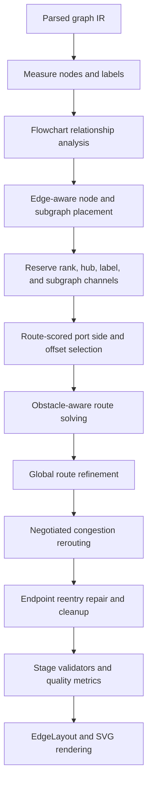

# Flowchart routing architecture

This document describes the current flowchart layout architecture after the port and arrow-pathing redesign. It is intended to make the routing model auditable: each stage has explicit inputs, outputs, invariants, and validation hooks.

## Goals

The routing pipeline optimizes for two classes of correctness.

1. **Hard correctness**
    - Arrow shafts leave the source port outward.
    - Arrow shafts enter the target port from outside the target node.
    - Endpoint stubs do not travel through endpoint node interiors.
    - Routes do not pass through non-endpoint node interiors.
    - Subgraph boundary crossings use explicit boundary ports when the visible endpoint is a subgraph.
    - Produced coordinates are finite and structurally complete.

2. **Quality and optimality metrics**
    - Lower bend count.
    - Shorter route length compared to center-to-center Manhattan distance.
    - Fewer edge crossings and overlaps.
    - Balanced side loads on busy nodes.
    - Reserved label and channel space so later stages do not introduce visual artifacts.

The code treats hard correctness as non-negotiable. Quality metrics are optimized subject to those hard constraints and bounded by performance tiers.

## High-level pipeline



## Relationship analysis before placement

Flowcharts are analyzed before coordinates are assigned. `FlowchartRelationshipAnalysis` records:

- node rank and component
- in-degree, out-degree, and hub score
- cyclic membership and back edges
- subgraph memberships and boundary crossings
- edge rank span and weight
- center and endpoint label size pressure

This analysis is used by placement and routing so the diagram is planned as a graph, not as independent node pairs.

## Node and subgraph placement

`assign_positions_manual` remains the main flowchart placement stage, but it is now edge-aware:

- Rank order preserves the graph direction while retaining ordering constraints for non-forward edges.
- Cross-axis centers use weighted medians from connected neighbors rather than only local ordering.
- Hubs receive extra cross-axis padding proportional to incident degree, boundary edges, labels, and cycles.
- Rank gaps are expanded before routing when center labels need reserved space.
- Subgraph cleanup preserves containment and separates sibling regions before routing obstacles are built.

The important architectural change is that label pressure, hubs, cycles, and boundary edges affect placement before route solving starts.

## Port selection

Ports are selected by scoring complete route candidates, not by choosing a side with a simple independent heuristic.

For each edge the pipeline considers candidate source and target sides and offsets:

- facing sides preferred by graph direction
- alternate sides for cycles, back edges, low-degree balancing, and crowded side loads
- offset candidates along each side, clamped to the shape boundary and route grid
- explicit subgraph boundary ports when an endpoint is represented by a visible subgraph boundary

Each full candidate is routed and scored with `PortRouteScore`. The score includes hard violations first, then quality terms such as node hits, label hits, crossings, overlaps, bends, route length, side-load balance, endpoint offset quality, and role-specific penalties. A candidate with fewer hard violations always beats a prettier but incorrect candidate.

## Route solving

Routes are orthogonal polylines with explicit endpoint stubs. The router receives:

- node and subgraph obstacles
- provisional label obstacles
- reserved routing channels
- existing edge segments and occupancy costs
- preferred label centers when labels should sit on a route
- selected port sides and offsets
- performance-tier settings

The primary solver is grid-based obstacle-aware routing. It is paired with deterministic heuristic and exterior fallback candidates for over-constrained diagrams. Fallbacks are gated so they are accepted only when they do not introduce hard geometry regressions.

## Global refinement and congestion negotiation

After initial routing, the pipeline improves routes with bounded passes:

1. **Global route refinement** reroutes edges against the current set of already chosen routes. It accepts a candidate only when the global score improves without hard regressions.
2. **Negotiated congestion routing** uses occupancy from other routes to rip up and reroute congested edges. It requires either hard improvement or enough visual congestion improvement while preserving hard correctness.
3. **Endpoint repair** specifically detects and reroutes endpoint reentry doglegs. This catches cases where a cleanup stage could otherwise leave an arrow touching the right point from the wrong side.

## Labels and channels

Labels are represented before routing as space requirements and obstacles:

- center labels can expand the main rank gap before nodes are placed
- route labels can request a preferred label center along the path
- label obstacles are included in candidate route scoring
- reserved rank and hub channels keep common corridors available for routes

This avoids the old failure mode where a label was moved after routing and then the route no longer matched the visual label placement.

## Subgraph boundary routing

When an edge connects to a node inside or outside a visible subgraph boundary, the visible routing endpoint may be the subgraph boundary. The subgraph boundary stage chooses a boundary port closest to the remote endpoint and routes through that side intentionally. This prevents incidental boundary intersections and avoids entering a subgraph through its title or unrelated side.

## Validation and diagnostics

Validation happens both inside the pipeline and in CI-friendly tools.

### Stage validators

`stage_validation` checks:

- node placement completeness and finite geometry
- port count and finite offsets
- route count, minimum route size, and finite route points
- endpoint direction violations
- endpoint node intrusions and reentries
- non-endpoint node hits
- final layout invariants and flowchart quality metrics

Debug builds assert structural and hard geometry invariants at stage boundaries.

### Quality example

`examples/port_quality.rs` walks fixture directories and reports aggregate metrics. Useful commands:

```bash
cargo run --example port_quality -- benches/fixtures
cargo run --example port_quality -- --json --strict --max-bends 3.0 --max-path-ratio 1.0 benches/fixtures
```

The strict mode fails if hard violations, geometry debt, bend count, or path ratio exceed configured thresholds.

### Visual report

`examples/flowchart_visual_report.rs` renders curated fixtures that stress arrowheads, ports, self-loops, labels, dense hubs, and subgraph boundary crossings:

```bash
cargo run --example flowchart_visual_report -- --output tmp/flowchart-visual-report
```

The report includes SVGs, Mermaid source, and per-fixture routing metrics.

## Performance tiers

The implementation uses bounded search tiers so small diagrams get stronger optimization and large diagrams remain predictable.

- **Exact**: small and moderately complex flowcharts get route-scored port selection, global refinement, and congestion passes.
- **Bounded**: larger flowcharts use capped candidate counts and pass counts.
- **Linear**: very large or stress diagrams keep hard correctness while limiting expensive global work.
- **Disabled**: non-flowchart diagrams skip flowchart-specific work.

The tier is selected from node count, edge count, label pressure, subgraph count, and configured complexity. This keeps the architecture deterministic and avoids unbounded search.

## Correctness guarantees and remaining limits

The current guarantee is practical layout correctness for the supported renderer invariants, not mathematical global optimality for every possible graph. Full global optimality for orthogonal graph drawing with obstacles is computationally expensive and can be NP-hard depending on the objective. The implementation therefore uses this policy:

1. Enforce hard geometric invariants.
2. Search exact or near-exact candidates when the graph is small enough.
3. Use bounded global and negotiated improvement for larger graphs.
4. Reject candidates that improve appearance but regress hard correctness.
5. Keep diagnostics and visual fixtures in the repository so new regressions are observable.

With the current fixture corpus, strict validation reports zero hard violations and zero geometry debt across the flowchart fixtures.
